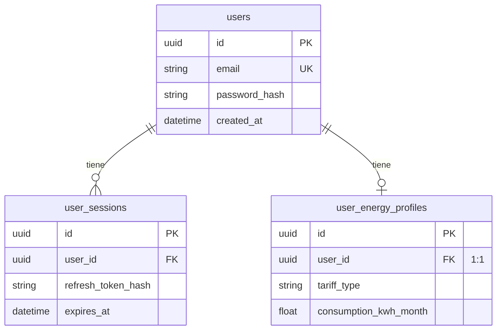
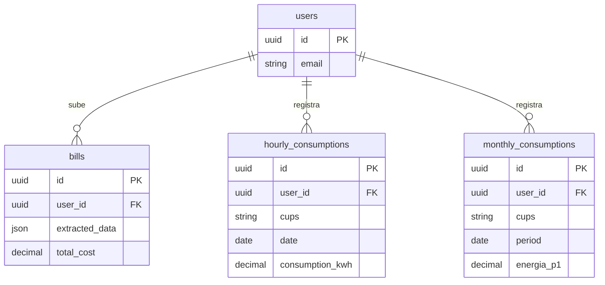
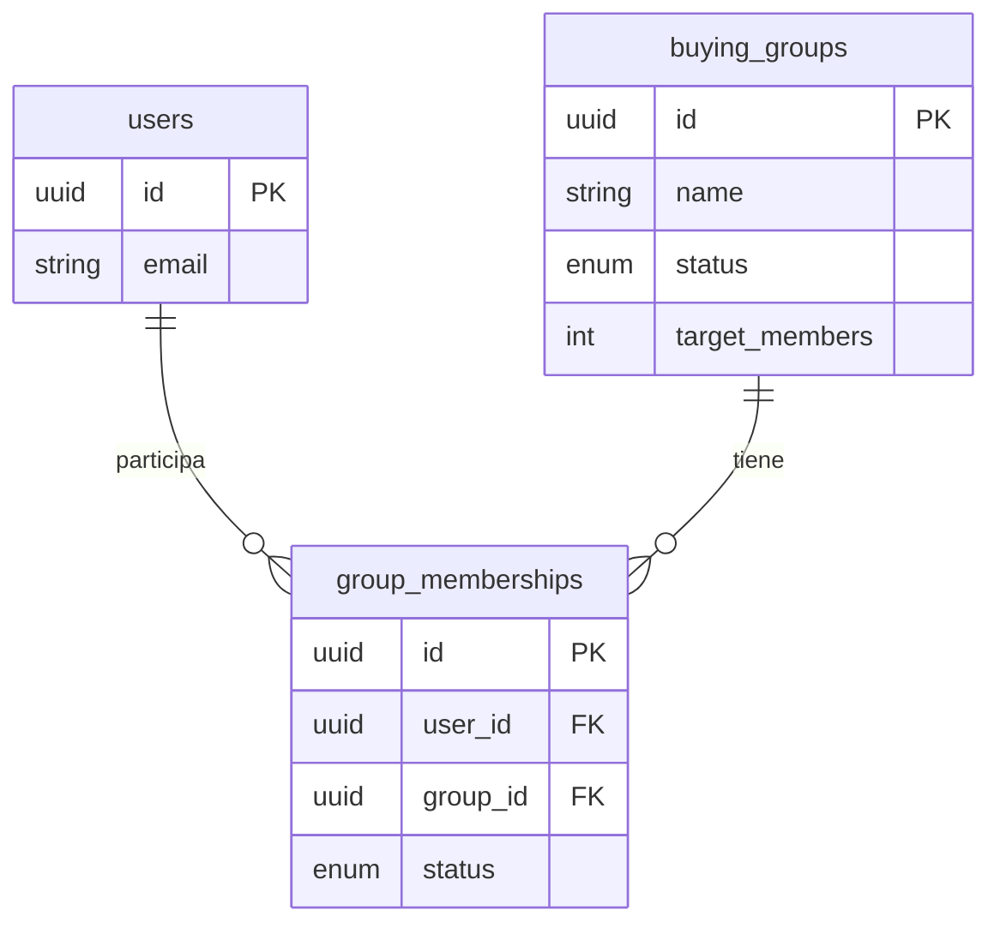
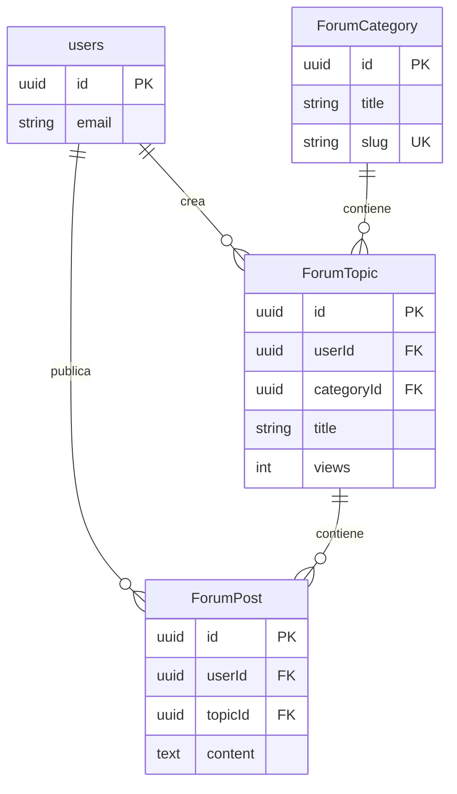

# BASE DE DATOS - Escoge tu Energía

**Documentación Completa del Modelo de Datos**

---

## Índice

1. [Información General](#información-general)
2. [Diagrama Entidad-Relación (ER)](#diagrama-entidad-relación-er)
3. [Diccionario de Datos](#diccionario-de-datos)
4. [Tipos de Datos y Enumeraciones](#tipos-de-datos-y-enumeraciones)
5. [Índices y Optimizaciones](#índices-y-optimizaciones)
6. [Políticas de Eliminación](#políticas-de-eliminación)

---

## Información General

### Motor de Base de Datos
- **Sistema**: MySQL 8.0+
- **ORM**: Prisma 6.19.0
- **Encoding**: UTF-8mb4 (soporte completo Unicode)
- **Collation**: utf8mb4_unicode_ci

### Nombre de la Base de Datos
```
escogetuenergia
```

### Ubicación del Schema
```
server/prisma/schema.prisma
```

### Total de Tablas
**15 tablas principales** organizadas en 4 módulos:
- **Módulo Usuarios**: 4 tablas
- **Módulo Energía**: 4 tablas  
- **Módulo Gamificación**: 3 tablas
- **Módulo Foro**: 3 tablas
- **Tabla Standalone**: 1 tabla (Tariff)

---

## Diagrama Entidad-Relación (ER)

### Diagrama Completo (Mermaid ERD)

```mermaid
erDiagram
    %% ============================================
    %% MÓDULO USUARIOS Y AUTENTICACIÓN
    %% ============================================
    
    users ||--o{ user_sessions : "tiene"
    users ||--o| user_energy_profiles : "tiene"
    users ||--o{ bills : "sube"
    users ||--o| gamification_stats : "tiene"
    users ||--o{ group_memberships : "participa"
    users ||--o{ reviews : "escribe"
    users ||--o{ user_badges : "obtiene"
    users ||--o{ hourly_consumptions : "registra"
    users ||--o{ monthly_consumptions : "registra"
    users ||--o{ ForumTopic : "crea"
    users ||--o{ ForumPost : "publica"
    
    %% ============================================
    %% MÓDULO COMPRA COLECTIVA
    %% ============================================
    
    buying_groups ||--o{ group_memberships : "tiene"
    
    %% ============================================
    %% MÓDULO FORO
    %% ============================================
    
    ForumCategory ||--o{ ForumTopic : "contiene"
    ForumTopic ||--o{ ForumPost : "contiene"
    
    %% ============================================
    %% DEFINICIÓN DE ENTIDADES
    %% ============================================
    
    users {
        uuid id PK
        string email UK "unique"
        string password_hash
        string full_name
        string first_name
        string last_name
        string phone
        string avatar_url
        datetime created_at
        datetime updated_at
    }
    
    user_sessions {
        uuid id PK
        uuid user_id FK
        string refresh_token_hash
        string user_agent
        string ip_address
        datetime created_at
        datetime expires_at
    }
    
    user_energy_profiles {
        uuid id PK
        uuid user_id FK "unique"
        string address
        string distributor
        string tariff_type
        float consumption_kwh_month
        float contracted_power_kw
        decimal monthly_bill
        string household_size
        string home_type
        string region
        enum consumption_pattern
        boolean has_electric_vehicle
        boolean has_solar_panels
        boolean has_heat_pump
        datetime created_at
    }
    
    bills {
        uuid id PK
        uuid user_id FK
        string file_path
        json extracted_data
        datetime period_start
        datetime period_end
        decimal total_cost
        float total_consumption_kwh
        datetime uploaded_at
    }
    
    tariffs {
        uuid id PK
        string company
        string plan_name
        decimal price_kwh
        decimal price_power_kw
        boolean is_green
        datetime created_at
    }
    
    hourly_consumptions {
        uuid id PK
        uuid user_id FK
        string cups
        date date
        time time
        decimal consumption_kwh
        string origin
        string method
        datetime created_at
    }
    
    monthly_consumptions {
        uuid id PK
        uuid user_id FK
        string cups
        date period
        decimal energia_p1
        decimal energia_p2
        decimal energia_p3
        decimal energia_p4
        decimal energia_p5
        decimal energia_p6
        string method
        datetime created_at
    }
    
    gamification_stats {
        uuid user_id PK-FK
        int total_points
        int current_level
        decimal total_savings
        decimal co2_saved_kg
        string referral_code
    }
    
    user_badges {
        uuid id PK
        uuid user_id FK
        string badge_id
        datetime unlocked_at
    }
    
    buying_groups {
        uuid id PK
        string name
        text description
        string provider
        int target_members
        int current_members
        decimal estimated_savings
        enum status
        datetime deadline
        datetime created_at
    }
    
    group_memberships {
        uuid id PK
        uuid user_id FK
        uuid group_id FK
        datetime joined_at
        enum status
    }
    
    reviews {
        uuid id PK
        uuid user_id FK
        string provider_name
        int rating
        string title
        text comment
        boolean is_verified
        int helpful_count
        datetime created_at
    }
    
    ForumCategory {
        uuid id PK
        string title
        string description
        string slug UK "unique"
        int order
        string icon
        datetime createdAt
    }
    
    ForumTopic {
        uuid id PK
        string title
        text content
        int views
        boolean isPinned
        boolean isLocked
        string type
        decimal price
        string status
        uuid userId FK
        uuid categoryId FK
        datetime createdAt
        datetime updatedAt
    }
    
    ForumPost {
        uuid id PK
        text content
        uuid userId FK
        uuid topicId FK
        datetime createdAt
        datetime updatedAt
    }
```

###  Diagrama por Módulos

#### Módulo 1: Usuarios y Autenticación



#### Módulo 2: Consumo Energético



#### Módulo 3: Gamificación

```mermaid
erDiagram
    users ||--o| gamification_stats : "tiene"
    users ||--o{ user_badges : "obtiene"
    users ||--o{ reviews : "escribe"
    
    users {
        uuid id PK
        string email
    }
    
    gamification_stats {
        uuid user_id PK-FK "1:1"
        int total_points
        int current_level
    }
    
    user_badges {
        uuid id PK
        uuid user_id FK
        string badge_id
        datetime unlocked_at
    }
    
    reviews {
        uuid id PK
        uuid user_id FK
        string provider_name
        int rating
    }
```

#### Módulo 4: Compra Colectiva



#### Módulo 5: Foro Comunitario



---

## Diccionario de Datos

### Tabla: `users`

**Descripción**: Almacena la información de los usuarios registrados en la plataforma.

| Campo | Tipo | Nulo | Default | Clave | Descripción |
|-------|------|------|---------|-------|-------------|
| `id` | UUID | NO | `uuid()` | PK | Identificador único del usuario |
| `email` | VARCHAR(255) | NO | - | UK | Correo electrónico (único) |
| `password_hash` | VARCHAR(255) | NO | - | - | Hash bcrypt de la contraseña |
| `full_name` | VARCHAR(255) | SÍ | NULL | - | Nombre completo del usuario |
| `first_name` | VARCHAR(255) | SÍ | NULL | - | Nombre |
| `last_name` | VARCHAR(255) | SÍ | NULL | - | Apellidos |
| `phone` | VARCHAR(50) | SÍ | NULL | - | Teléfono de contacto |
| `avatar_url` | VARCHAR(500) | SÍ | NULL | - | URL de la imagen de perfil |
| `created_at` | DATETIME | NO | `now()` | - | Fecha de registro |
| `updated_at` | DATETIME | NO | `now()` | - | Última actualización del perfil |

**Relaciones**:
- 1:N con `user_sessions`
- 1:1 con `user_energy_profiles`
- 1:N con `bills`
- 1:1 con `gamification_stats`
- 1:N con `group_memberships`
- 1:N con `reviews`
- 1:N con `user_badges`
- 1:N con `hourly_consumptions`
- 1:N con `monthly_consumptions`
- 1:N con `ForumTopic`
- 1:N con `ForumPost`

---

###  Tabla: `user_sessions`

**Descripción**: Gestiona las sesiones activas de los usuarios (JWT refresh tokens).

| Campo | Tipo | Nulo | Default | Clave | Descripción |
|-------|------|------|---------|-------|-------------|
| `id` | UUID | NO | `uuid()` | PK | Identificador único de la sesión |
| `user_id` | UUID | NO | - | FK | Referencia a `users.id` |
| `refresh_token_hash` | VARCHAR(500) | SÍ | NULL | - | Hash del refresh token JWT |
| `user_agent` | VARCHAR(500) | SÍ | NULL | - | User-Agent del navegador |
| `ip_address` | VARCHAR(45) | SÍ | NULL | - | Dirección IP del cliente |
| `created_at` | DATETIME | NO | `now()` | - | Fecha de creación de la sesión |
| `expires_at` | DATETIME | NO | - | - | Fecha de expiración del token |

**Índices**:
- `user_sessions_user_id_fkey` en `user_id`

**Relaciones**:
- N:1 con `users` (ON DELETE CASCADE)

---

### Tabla: `user_energy_profiles`

**Descripción**: Perfil energético del usuario (consumo, tipo de vivienda, instalaciones).

| Campo | Tipo | Nulo | Default | Clave | Descripción |
|-------|------|------|---------|-------|-------------|
| `id` | UUID | NO | `uuid()` | PK | Identificador del perfil |
| `user_id` | UUID | NO | - | FK, UK | Referencia única a `users.id` |
| `address` | VARCHAR(500) | SÍ | NULL | - | Dirección de suministro |
| `distributor` | VARCHAR(255) | SÍ | NULL | - | Distribuidora eléctrica |
| `tariff_type` | VARCHAR(100) | SÍ | NULL | - | Tipo de tarifa (2.0TD, 3.0TD, etc.) |
| `consumption_kwh_month` | FLOAT | SÍ | NULL | - | Consumo mensual estimado en kWh |
| `contracted_power_kw` | FLOAT | SÍ | NULL | - | Potencia contratada en kW |
| `monthly_bill` | DECIMAL(10,2) | SÍ | NULL | - | Factura mensual promedio en € |
| `household_size` | VARCHAR(50) | SÍ | NULL | - | Tamaño del hogar (ej: "1-2 personas") |
| `home_type` | VARCHAR(50) | SÍ | NULL | - | Tipo de vivienda (piso, casa, etc.) |
| `region` | VARCHAR(100) | SÍ | NULL | - | Región geográfica |
| `consumption_pattern` | ENUM | SÍ | NULL | - | Patrón de consumo (diurno/nocturno/mixto) |
| `has_electric_vehicle` | BOOLEAN | SÍ | `false` | - | Posee vehículo eléctrico |
| `has_solar_panels` | BOOLEAN | SÍ | `false` | - | Tiene paneles solares |
| `has_heat_pump` | BOOLEAN | SÍ | `false` | - | Tiene bomba de calor |
| `created_at` | DATETIME | NO | `now()` | - | Fecha de creación del perfil |

**Relaciones**:
- 1:1 con `users` (ON DELETE CASCADE)

---

###  Tabla: `bills`

**Descripción**: Facturas eléctricas subidas por los usuarios.

| Campo | Tipo | Nulo | Default | Clave | Descripción |
|-------|------|------|---------|-------|-------------|
| `id` | UUID | NO | `uuid()` | PK | Identificador único de la factura |
| `user_id` | UUID | NO | - | FK | Referencia a `users.id` |
| `file_path` | VARCHAR(500) | NO | - | - | Ruta del archivo en servidor |
| `extracted_data` | JSON | SÍ | NULL | - | Datos extraídos del PDF/CSV |
| `period_start` | DATE | SÍ | NULL | - | Inicio del periodo de facturación |
| `period_end` | DATE | SÍ | NULL | - | Fin del periodo de facturación |
| `total_cost` | DECIMAL(10,2) | SÍ | NULL | - | Coste total de la factura en € |
| `total_consumption_kwh` | FLOAT | SÍ | NULL | - | Consumo total en kWh |
| `uploaded_at` | DATETIME | NO | `now()` | - | Fecha de subida |

**Índices**:
- `bills_user_id_fkey` en `user_id`

**Relaciones**:
- N:1 con `users` (ON DELETE CASCADE)

---

### Tabla: `tariffs`

**Descripción**: Catálogo de tarifas eléctricas disponibles de diferentes compañías.

| Campo | Tipo | Nulo | Default | Clave | Descripción |
|-------|------|------|---------|-------|-------------|
| `id` | UUID | NO | `uuid()` | PK | Identificador único de la tarifa |
| `company` | VARCHAR(255) | NO | - | - | Nombre de la compañía eléctrica |
| `plan_name` | VARCHAR(255) | NO | - | - | Nombre del plan comercial |
| `price_kwh` | DECIMAL(10,5) | NO | - | - | Precio por kWh en €/kWh |
| `price_power_kw` | DECIMAL(10,5) | NO | - | - | Precio de potencia en €/kW/día |
| `is_green` | BOOLEAN | NO | `false` | - | Indica si es energía 100% renovable |
| `created_at` | DATETIME | NO | `now()` | - | Fecha de creación del registro |

**Nota**: Esta tabla no tiene relaciones directas (standalone).

---

###  Tabla: `hourly_consumptions`

**Descripción**: Registros de consumo eléctrico por hora (importado desde Datadis).

| Campo | Tipo | Nulo | Default | Clave | Descripción |
|-------|------|------|---------|-------|-------------|
| `id` | UUID | NO | `uuid()` | PK | Identificador único del registro |
| `user_id` | UUID | NO | - | FK | Referencia a `users.id` |
| `cups` | VARCHAR(50) | NO | - | - | Código CUPS del punto de suministro |
| `date` | DATE | NO | - | - | Fecha del consumo |
| `time` | TIME | NO | - | - | Hora del consumo |
| `consumption_kwh` | DECIMAL(10,4) | NO | - | - | Consumo en kWh para esa hora |
| `origin` | VARCHAR(30) | SÍ | `'datadis_csv'` | - | Origen de los datos |
| `method` | VARCHAR(20) | SÍ | `'datadis'` | - | Método de obtención |
| `created_at` | DATETIME | NO | `now()` | - | Fecha de inserción en BD |

**Índices**:
- `idx_user_date` compuesto en `(user_id, date)`

**Relaciones**:
- N:1 con `users` (ON DELETE CASCADE)

---

###  Tabla: `monthly_consumptions`

**Descripción**: Consumos mensuales agregados por periodo tarifario (P1-P6).

| Campo | Tipo | Nulo | Default | Clave | Descripción |
|-------|------|------|---------|-------|-------------|
| `id` | UUID | NO | `uuid()` | PK | Identificador único del registro |
| `user_id` | UUID | NO | - | FK | Referencia a `users.id` |
| `cups` | VARCHAR(50) | NO | - | - | Código CUPS |
| `period` | DATE | NO | - | - | Mes del consumo (YYYY-MM-01) |
| `energia_p1` | DECIMAL(12,3) | SÍ | NULL | - | Consumo periodo P1 (punta) en kWh |
| `energia_p2` | DECIMAL(12,3) | SÍ | NULL | - | Consumo periodo P2 en kWh |
| `energia_p3` | DECIMAL(12,3) | SÍ | NULL | - | Consumo periodo P3 en kWh |
| `energia_p4` | DECIMAL(12,3) | SÍ | NULL | - | Consumo periodo P4 en kWh |
| `energia_p5` | DECIMAL(12,3) | SÍ | NULL | - | Consumo periodo P5 en kWh |
| `energia_p6` | DECIMAL(12,3) | SÍ | NULL | - | Consumo periodo P6 (valle) en kWh |
| `method` | VARCHAR(20) | SÍ | `'csv'` | - | Método de obtención |
| `created_at` | DATETIME | NO | `now()` | - | Fecha de inserción |

**Índices**:
- `idx_user_period` compuesto en `(user_id, period)`

**Relaciones**:
- N:1 con `users` (ON DELETE CASCADE)

---

###  Tabla: `gamification_stats`

**Descripción**: Estadísticas de gamificación del usuario (puntos, nivel, ahorros).

| Campo | Tipo | Nulo | Default | Clave | Descripción |
|-------|------|------|---------|-------|-------------|
| `user_id` | UUID | NO | - | PK, FK | Referencia a `users.id` (clave primaria) |
| `total_points` | INT | SÍ | `0` | - | Puntos totales acumulados |
| `current_level` | INT | SÍ | `1` | - | Nivel actual del usuario |
| `total_savings` | DECIMAL(10,2) | SÍ | `0.00` | - | Ahorro total estimado en € |
| `co2_saved_kg` | DECIMAL(10,2) | SÍ | `0.00` | - | kg de CO2 ahorrados |
| `referral_code` | VARCHAR(20) | SÍ | NULL | - | Código de referido único |

**Relaciones**:
- 1:1 con `users` (ON DELETE CASCADE)

---

### Tabla: `user_badges`

**Descripción**: Insignias/logros desbloqueados por los usuarios.

| Campo | Tipo | Nulo | Default | Clave | Descripción |
|-------|------|------|---------|-------|-------------|
| `id` | UUID | NO | `uuid()` | PK | Identificador único |
| `user_id` | UUID | NO | - | FK | Referencia a `users.id` |
| `badge_id` | VARCHAR(50) | NO | - | - | Código de la insignia (ej: 'FIRST_BILL') |
| `unlocked_at` | DATETIME | NO | `now()` | - | Fecha de desbloqueo |

**Índices**:
- `user_badges_user_fkey` en `user_id`

**Relaciones**:
- N:1 con `users` (ON DELETE CASCADE)

---

###  Tabla: `buying_groups`

**Descripción**: Grupos de compra colectiva de energía.

| Campo | Tipo | Nulo | Default | Clave | Descripción |
|-------|------|------|---------|-------|-------------|
| `id` | UUID | NO | `uuid()` | PK | Identificador único del grupo |
| `name` | VARCHAR(255) | NO | - | - | Nombre del grupo |
| `description` | TEXT | SÍ | NULL | - | Descripción del grupo |
| `provider` | VARCHAR(255) | SÍ | NULL | - | Proveedor con el que se negocia |
| `target_members` | INT | SÍ | `100` | - | Número objetivo de miembros |
| `current_members` | INT | SÍ | `0` | - | Miembros actuales |
| `estimated_savings` | DECIMAL(10,2) | SÍ | NULL | - | Ahorro estimado en € |
| `status` | ENUM | SÍ | `'active'` | - | Estado del grupo (active/full/negotiating/completed) |
| `deadline` | DATETIME | SÍ | NULL | - | Fecha límite para unirse |
| `created_at` | DATETIME | NO | `now()` | - | Fecha de creación |

**Relaciones**:
- 1:N con `group_memberships`

---

###  Tabla: `group_memberships`

**Descripción**: Relación muchos-a-muchos entre usuarios y grupos de compra.

| Campo | Tipo | Nulo | Default | Clave | Descripción |
|-------|------|------|---------|-------|-------------|
| `id` | UUID | NO | `uuid()` | PK | Identificador único |
| `user_id` | UUID | NO | - | FK | Referencia a `users.id` |
| `group_id` | UUID | NO | - | FK | Referencia a `buying_groups.id` |
| `joined_at` | DATETIME | NO | `now()` | - | Fecha de unión al grupo |
| `status` | ENUM | SÍ | `'active'` | - | Estado (pending/active/completed) |

**Índices**:
- `group_memberships_user_fkey` en `user_id`
- `group_memberships_group_fkey` en `group_id`

**Relaciones**:
- N:1 con `users` (ON DELETE CASCADE)
- N:1 con `buying_groups` (ON DELETE CASCADE)

---

### ⭐ Tabla: `reviews`

**Descripción**: Reseñas de usuarios sobre proveedores de energía.

| Campo | Tipo | Nulo | Default | Clave | Descripción |
|-------|------|------|---------|-------|-------------|
| `id` | UUID | NO | `uuid()` | PK | Identificador único |
| `user_id` | UUID | NO | - | FK | Referencia a `users.id` |
| `provider_name` | VARCHAR(255) | NO | - | - | Nombre del proveedor evaluado |
| `rating` | INT | SÍ | NULL | - | Puntuación (1-5 estrellas) |
| `title` | VARCHAR(255) | SÍ | NULL | - | Título de la reseña |
| `comment` | TEXT | SÍ | NULL | - | Comentario detallado |
| `is_verified` | BOOLEAN | SÍ | `false` | - | ¿Reseña verificada por admin? |
| `helpful_count` | INT | SÍ | `0` | - | Votos de "útil" |
| `created_at` | DATETIME | NO | `now()` | - | Fecha de publicación |

**Índices**:
- `reviews_user_fkey` en `user_id`

**Relaciones**:
- N:1 con `users` (ON DELETE CASCADE)

---

###  Tabla: `ForumCategory`

**Descripción**: Categorías del foro comunitario.

| Campo | Tipo | Nulo | Default | Clave | Descripción |
|-------|------|------|---------|-------|-------------|
| `id` | UUID | NO | `uuid()` | PK | Identificador único |
| `title` | VARCHAR(255) | NO | - | - | Nombre de la categoría |
| `description` | TEXT | SÍ | NULL | - | Descripción de la categoría |
| `slug` | VARCHAR(255) | NO | - | UK | URL-friendly identifier (único) |
| `order` | INT | NO | `0` | - | Orden de visualización |
| `icon` | VARCHAR(100) | SÍ | NULL | - | Icono representativo |
| `createdAt` | DATETIME | NO | `now()` | - | Fecha de creación |

**Relaciones**:
- 1:N con `ForumTopic`

---

### Tabla: `ForumTopic`

**Descripción**: Temas/hilos de discusión del foro.

| Campo | Tipo | Nulo | Default | Clave | Descripción |
|-------|------|------|---------|-------|-------------|
| `id` | UUID | NO | `uuid()` | PK | Identificador único |
| `title` | VARCHAR(255) | NO | - | - | Título del tema |
| `content` | TEXT | NO | - | - | Contenido inicial del tema |
| `views` | INT | NO | `0` | - | Número de visualizaciones |
| `isPinned` | BOOLEAN | NO | `false` | - | ¿Tema fijado? |
| `isLocked` | BOOLEAN | NO | `false` | - | ¿Tema cerrado a comentarios? |
| `type` | VARCHAR(50) | NO | `'discussion'` | - | Tipo de tema (discussion, question, etc.) |
| `price` | DECIMAL(10,2) | SÍ | NULL | - | Precio (si es un marketplace) |
| `status` | VARCHAR(50) | NO | `'active'` | - | Estado del tema |
| `userId` | UUID | NO | - | FK | Autor del tema (ref `users.id`) |
| `categoryId` | UUID | NO | - | FK | Categoría (ref `ForumCategory.id`) |
| `createdAt` | DATETIME | NO | `now()` | - | Fecha de creación |
| `updatedAt` | DATETIME | NO | `now()` | - | Última actualización |

**Relaciones**:
- N:1 con `users` (ON DELETE CASCADE)
- N:1 con `ForumCategory`
- 1:N con `ForumPost`

---

###  Tabla: `ForumPost`

**Descripción**: Respuestas/comentarios en los temas del foro.

| Campo | Tipo | Nulo | Default | Clave | Descripción |
|-------|------|------|---------|-------|-------------|
| `id` | UUID | NO | `uuid()` | PK | Identificador único |
| `content` | TEXT | NO | - | - | Contenido de la respuesta |
| `userId` | UUID | NO | - | FK | Autor (ref `users.id`) |
| `topicId` | UUID | NO | - | FK | Tema al que pertenece (ref `ForumTopic.id`) |
| `createdAt` | DATETIME | NO | `now()` | - | Fecha de publicación |
| `updatedAt` | DATETIME | NO | `now()` | - | Última edición |

**Relaciones**:
- N:1 con `users` (ON DELETE CASCADE)
- N:1 con `ForumTopic` (ON DELETE CASCADE)

---

## Tipos de Datos y Enumeraciones

###  Tipos de Datos Prisma → MySQL

| Tipo Prisma | Tipo MySQL | Ejemplo |
|-------------|------------|---------|
| `String` | `VARCHAR(255)` | 'Juan Pérez' |
| `Int` | `INT` | 42 |
| `Float` | `DOUBLE` | 3.14159 |
| `Boolean` | `TINYINT(1)` | 0 o 1 |
| `DateTime` | `DATETIME(3)` | '2026-01-15 10:30:00.000' |
| `Decimal` | `DECIMAL(p,s)` | 123.45 |
| `Json` | `JSON` | `{"key": "value"}` |
| `@db.Text` | `TEXT` | Texto largo |
| `@db.Date` | `DATE` | '2026-01-15' |
| `@db.Time(0)` | `TIME` | '14:30:00' |
| `@default(uuid())` | `CHAR(36)` | 'a1b2c3d4-e5f6-...' |

---

### Enumeraciones (ENUMs)

#### `user_energy_profiles_consumption_pattern`

Patrón de consumo eléctrico del usuario.

```prisma
enum user_energy_profiles_consumption_pattern {
  diurno    // Consumo principalmente durante el día
  nocturno  // Consumo principalmente durante la noche
  mixto     // Consumo distribuido día y noche
}
```

**Uso**: Campo `consumption_pattern` en `user_energy_profiles`

**Valores SQL**:
```sql
ENUM('diurno', 'nocturno', 'mixto')
```

---

#### `buying_groups_status`

Estado del grupo de compra colectiva.

```prisma
enum buying_groups_status {
  active       // Grupo activo, aceptando miembros
  full         // Grupo lleno, objetivo alcanzado
  negotiating  // En proceso de negociación con proveedor
  completed    // Negociación completada, grupo cerrado
}
```

**Uso**: Campo `status` en `buying_groups`

**Valores SQL**:
```sql
ENUM('active', 'full', 'negotiating', 'completed')
```

---

#### `group_memberships_status`

Estado de la membresía de un usuario en un grupo.

```prisma
enum group_memberships_status {
  pending    // Solicitud pendiente de aprobación
  active     // Miembro activo del grupo
  completed  // Proceso completado
}
```

**Uso**: Campo `status` en `group_memberships`

**Valores SQL**:
```sql
ENUM('pending', 'active', 'completed')
```

---

### Tipos Especiales y Constraints

#### UUID (Identificadores Únicos)

Todos los `id` de las tablas principales usan UUID v4:

```prisma
@id @default(uuid())
```

**Formato**: `a1b2c3d4-e5f6-7890-abcd-ef1234567890`  
**Ventajas**: Distribuido, no secuencial, seguro

---

#### JSON (Datos Semi-Estructurados)

Campo `extracted_data` en `bills`:

```json
{
  "company": "Iberdrola",
  "total_cost": 89.45,
  "consumption_kwh": 350,
  "period": {
    "start": "2025-12-01",
    "end": "2025-12-31"
  },
  "line_items": [
    {
      "concept": "Energía",
      "amount": 65.30
    }
  ]
}
```

---

#### DECIMAL (Precisión Financiera)

Para cantidades monetarias y consumos precisos:

```prisma
@db.Decimal(10, 2)  // 10 dígitos totales, 2 decimales
```

**Ejemplos**:
- `12345678.90`
- `0.05`
- `999999.99`

---

### Formatos de Fecha y Hora

| Campo | Tipo | Formato | Ejemplo |
|-------|------|---------|---------|
| `created_at` | `DateTime` | ISO 8601 | `2026-01-15T10:30:00.000Z` |
| `date` | `@db.Date` | YYYY-MM-DD | `2026-01-15` |
| `time` | `@db.Time(0)` | HH:MM:SS | `14:30:00` |
| `expires_at` | `DateTime` | ISO 8601 | `2026-01-22T10:30:00.000Z` |

---

## Índices y Optimizaciones

### Índices Compuestos

#### `hourly_consumptions`
```sql
INDEX idx_user_date ON hourly_consumptions(user_id, date);
```
**Propósito**: Acelerar consultas de consumo por usuario y fecha.

#### `monthly_consumptions`
```sql
INDEX idx_user_period ON monthly_consumptions(user_id, period);
```
**Propósito**: Optimizar consultas de consumo mensual.

---

### Índices de Clave Foránea

Todos los `FK` tienen índices automáticos:
- `user_sessions.user_id`
- `bills.user_id`
- `group_memberships.user_id`
- `group_memberships.group_id`
- `reviews.user_id`
- `user_badges.user_id`

---

### Claves Únicas (UNIQUE)

| Tabla | Campo | Propósito |
|-------|-------|----------|
| `users` | `email` | Evitar duplicados de correo |
| `user_energy_profiles` | `user_id` | Relación 1:1 con usuarios |
| `ForumCategory` | `slug` | URLs únicas para categorías |

---

## Políticas de Eliminación

### ️ ON DELETE CASCADE

Cuando se elimina un usuario, se eliminan automáticamente:

```
users (DELETE)
  ├─> user_sessions (CASCADE)
  ├─> user_energy_profiles (CASCADE)
  ├─> bills (CASCADE)
  ├─> gamification_stats (CASCADE)
  ├─> group_memberships (CASCADE)
  ├─> reviews (CASCADE)
  ├─> user_badges (CASCADE)
  ├─> hourly_consumptions (CASCADE)
  ├─> monthly_consumptions (CASCADE)
  ├─> ForumTopic (CASCADE)
  └─> ForumPost (CASCADE)
```

**Otras cascadas**:
- `buying_groups` → `group_memberships` (CASCADE)
- `ForumCategory` → `ForumTopic` (sin cascade explícito)
- `ForumTopic` → `ForumPost` (CASCADE)

---

## Estadísticas de la Base de Datos

| Métrica | Valor |
|---------|-------|
| **Total de Tablas** | 15 |
| **Total de Campos** | ~120 |
| **Total de Relaciones** | 18 |
| **Enumeraciones** | 3 |
| **Índices Compuestos** | 2 |
| **Claves Únicas** | 3 |
| **Políticas CASCADE** | 13 |

---

## Historial de Migraciones

```
20251113002404_init/                    # Migración inicial
20251113023055_add_social_fields/       # Campos sociales
20251117140000_add_user_name_fields/    # Nombres de usuario
20251128000000_add_hourly_consumptions/ # Tabla consumo horario
20251130000000_add_monthly_consumptions/# Tabla consumo mensual
20251130130000_add_origin_to_hourly/    # Campo origin en hourly
20260112100655_remove_oauth/            # Eliminación OAuth
```

---

## Comandos Útiles

### Generar Prisma Client
```bash
cd server
npm run prisma:generate
```

### Crear nueva migración
```bash
npx prisma migrate dev --name nombre_descriptivo
```

### Aplicar migraciones en producción
```bash
npx prisma migrate deploy
```

### Resetear base de datos (desarrollo)
```bash
npx prisma migrate reset
```

### Abrir Prisma Studio (GUI)
```bash
npx prisma studio
```

---

## Referencias

- [Prisma Schema Reference](https://www.prisma.io/docs/reference/api-reference/prisma-schema-reference)
- [MySQL Data Types](https://dev.mysql.com/doc/refman/8.0/en/data-types.html)
- [Mermaid ERD Syntax](https://mermaid.js.org/syntax/entityRelationshipDiagram.html)

---

**Documento generado**: Enero 2026  
**Versión de Prisma**: 6.19.0  
**Versión de MySQL**: 8.0+  
**Última actualización**: 2026-01-15
